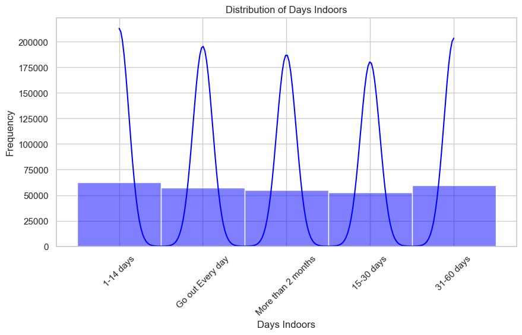

**Project Title:** Mental Health Survey Analysis

**Project Overview**  
This project aims to analyze a mental health survey dataset to understand the prevalence of mental health issues, common challenges faced by individuals, and the potential factors influencing mental health. By utilizing data visualization techniques, such as histograms, bar charts, and correlation heatmaps, this analysis will visualize the distribution of variables and examine relationships between them. Additionally, hierarchical clustering will help group individuals with similar characteristics and uncover distinct patterns within the data.

**Problem Statement**  
Mental health is a critical aspect of overall well-being, yet it is often overlooked and underfunded. Many individuals face barriers such as stigma, lack of access to care, and unawareness of coping strategies, which can worsen mental health challenges. This project seeks to identify prevalent mental health issues, explore factors influencing mental health, and provide actionable insights. Understanding these areas can contribute to more effective mental health interventions, policies, and awareness efforts.

**Project Objectives**  
- **Understand the prevalence of mental health issues:** Analyze mental health-related variables to identify common challenges and assess the spread of mental health conditions among individuals.
- **Explore relationships between variables:** Investigate correlations among variables to uncover potential factors that influence mental health.
- **Identify distinct groups within the data:** Use hierarchical clustering to group individuals based on similar characteristics, identifying distinct mental health patterns.
- **Provide insights and recommendations:** Based on the analysis, offer insights into the factors affecting mental health and provide recommendations for individuals, organizations, and policymakers.

**Data Visualization and Interpretations**  
- **Distribution of Days Indoors:**

- 

  A bimodal distribution highlights two common patterns—frequent outings and extended indoor periods—which may relate to varying mental health impacts from social isolation.
  
- **Distribution of Growing Stress:**  
  A bimodal distribution indicates that a significant part of the population experiences increasing stress, with the "Maybe" category illustrating the subjective nature of stress perception.
  
- **Distribution of Coping Struggles:**  
  A bimodal, skewed distribution suggests many individuals face coping difficulties, with a few experiencing severe challenges.
  
- **Treatment Distribution:**  
  An even distribution suggests balanced treatment-seeking behaviors, likely impacted by factors such as cost, accessibility, or stigma.
  
- **Self Employment Distribution:**  
  A higher "No" response indicates that traditional employment is more common, potentially due to barriers like limited capital, skills, or opportunities.
  
- **Family History Distribution:**  
  A higher frequency of "No" suggests a less prevalent family history of mental health issues, indicating that other factors such as environment and lifestyle may also play significant roles.

- **Correlation Heatmap:**  
  Weak correlations show limited relationships between variables. Notably, "Treatment" is positively correlated with "family_history" and "care_options," indicating factors affecting treatment-seeking behavior. Additionally, a negative correlation between "Mental_Health_History" and "Work_Interest" highlights challenges faced by individuals with a history of mental health issues in maintaining work interest.

**Hierarchical Clustering**  
Hierarchical clustering analysis revealed three distinct clusters within the dataset, suggesting natural groupings based on similar characteristics. Further examination can help identify defining traits of each group.

**Insights and Recommendations**  
1. **Stress Management:** Offer training on effective stress management techniques.
2. **Coping Skills Training:** Provide programs to help individuals develop robust coping mechanisms.
3. **Mental Health Support:** Encourage professional help-seeking and the use of support networks.
4. **Address Barriers to Treatment:** Work to remove barriers, including cost, accessibility, and stigma, to improve access to mental health care.
5. **Promote Early Intervention:** Advocate for early intervention to prevent mental health issues from escalating.
6. **Reduce Stigma:** Support ongoing efforts to reduce the stigma around mental health.

**Conclusion: Mental Health Awareness**  
This analysis emphasizes the importance of mental health awareness and accessible, effective mental health services. Understanding the factors that impact mental health and providing the appropriate support can enable individuals to manage their challenges and lead healthier, more fulfilling lives.
